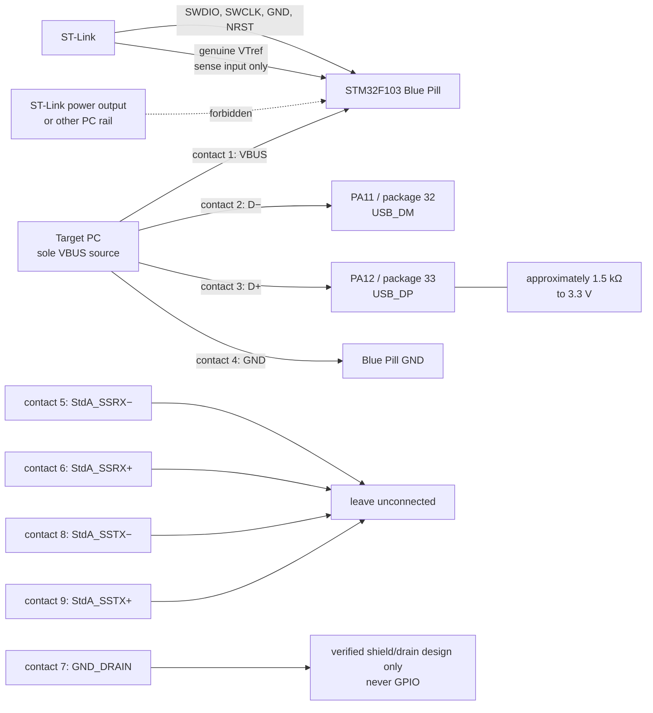

# Hardware wiring and safety boundary

This document defines the electrical boundary between an STM32F103C8T6 Blue Pill, its ST-Link/SWD controller connection, and the target-facing USB Standard-A cable. Treat the contact numbers below as requirements to verify, not as a substitute for probing the particular connector.

## Non-negotiable electrical facts

- STM32 **PA11, package pin 32, is `USB_DM` (D−)**.
- STM32 **PA12, package pin 33, is `USB_DP` (D+)**.
- The STM32F103 USB peripheral is **USB 2.0 full-speed only (12 Mbit/s)**. It has no USB 3.x PHY.
- With every piece of equipment powered off, continuity-map **all nine Standard-A contacts from the actual solder side**. Record which way the solder side was viewed before trusting a contact number. Verify contact 2 reaches PA11, contact 3 reaches PA12, contact 1 is target-supplied VBUS, and contact 4 is ground.
- Disconnect PB4–PB8 from Standard-A contacts 5–9 before applying power. Contacts 5 and 6 are `StdA_SSRX−/+`, contact 7 is `GND_DRAIN`, and contacts 8 and 9 are `StdA_SSTX−/+`; none may connect to an STM32F103 GPIO. Leave contacts 5, 6, 8, and 9 unconnected. Connect contact 7 only according to a verified cable shield/drain design, never to GPIO.
- Measure the board's D+ pull-up with power off. Require approximately **1.5 kΩ from D+ to the 3.3 V domain**. Repair the common wrong-value or missing Blue Pill pull-up implementation before any USB test.
- The target PC is the **only VBUS source**. Do not connect an ST-Link power-output pin or another PC's 5 V or 3.3 V rail.
- The only permitted ST-Link connections are **SWDIO, SWCLK, GND, NRST, and genuine ST-Link VTref used as a voltage-sense input only**. A pin merely labelled 3.3 V is not assumed to be genuine sense-only VTref.
- Verify the two PCs' ground potential before connection or use an isolated debug link. Never defeat protective earth.

## Standard-A contact contract

The following assignment covers every contact. It must be continuity-verified on the actual hardware while all equipment is off.

| Contact | Standard-A signal | Required disposition |
|---:|---|---|
| 1 | VBUS | Supplied by the target PC only; do not join to ST-Link power or another PC rail. |
| 2 | D− | Must reach STM32 PA11, package pin 32, `USB_DM`. |
| 3 | D+ | Must reach STM32 PA12, package pin 33, `USB_DP`; verify the approximately 1.5 kΩ pull-up to 3.3 V. |
| 4 | GND | Common signal ground; first verify ground potential or use an isolated debug link. |
| 5 | `StdA_SSRX−` | Leave unconnected; never connect to F103 GPIO. |
| 6 | `StdA_SSRX+` | Leave unconnected; never connect to F103 GPIO. |
| 7 | `GND_DRAIN` | Connect only under a verified cable shield/drain design; never connect to GPIO. |
| 8 | `StdA_SSTX−` | Leave unconnected; never connect to F103 GPIO. |
| 9 | `StdA_SSTX+` | Leave unconnected; never connect to F103 GPIO. |

PB4–PB8 must be disconnected from contacts 5–9 before power is applied. The SuperSpeed contacts do not extend the F103's capabilities and are not usable as GPIO wiring.

## Project-authored ASCII wiring diagram

The diagram is a logical wiring contract, not a physical contact-orientation guide. Determine numbering by continuity from the connector's actual solder side and record the viewed orientation on the printable checklist.

```text
                         TARGET PC (only VBUS source)
                         USB 2.0 full-speed, 12 Mbit/s
                                      |
              Standard-A contact 1 VBUS --- target sense/use only
              Standard-A contact 2 D-   ---------------- PA11 / pin 32 / USB_DM
              Standard-A contact 3 D+   ---------------- PA12 / pin 33 / USB_DP
                                      |                    |
                                      |              ~1.5 kΩ to 3.3 V
              Standard-A contact 4 GND -------------------- GND

              Standard-A contact 5 SSRX- ---- X  leave unconnected
              Standard-A contact 6 SSRX+ ---- X  leave unconnected
              Standard-A contact 7 DRAIN ---- shield/drain only if verified;
                                                   never GPIO
              Standard-A contact 8 SSTX- ---- X  leave unconnected
              Standard-A contact 9 SSTX+ ---- X  leave unconnected

 CONTROLLER PC                 ST-LINK                       BLUE PILL
                              SWDIO ------------------------- SWDIO
                              SWCLK ------------------------- SWCLK
                              NRST  ------------------------- NRST
                              GND   ------------------------- GND
              genuine VTref sense-only --------------------- target voltage sense
              power output / 5 V / 3.3 V ------- X           DO NOT CONNECT

 Verify PC ground potential, or isolate the debug link. Never defeat protective earth.
```

## Project-authored Mermaid wiring diagram



## Controlled USB disconnect

The Blue Pill commonly has a fixed external D+ pull-up, so firmware uses a controlled disconnect at boot and profile change:

1. Disable the USB peripheral.
2. Put PA11 in input/high-impedance mode.
3. Drive PA12 low as a GPIO for 20 ms, sinking only the D+ pull-up current.
4. Restore PA11 and PA12 to USB mode.
5. Only then initialize TinyUSB.

Reaching step 5 is not proof of a successful profile switch. Success may be reported only after the target host has re-enumerated and the controller has verified the expected profile. If a particular board cannot re-enumerate by this method, use a GPIO-controlled D+ pull-up/transistor as the hardware remedy or manually unplug and reconnect USB.

Use [the printable continuity checklist](continuity-checklist.md) for every newly built or modified cable/board assembly.
